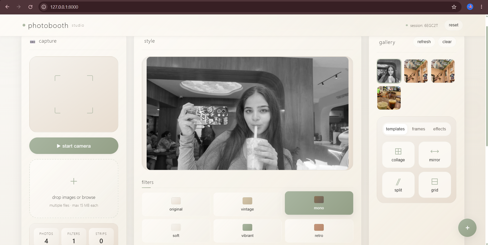
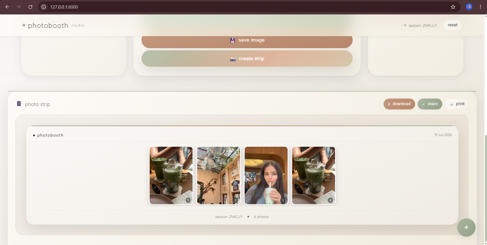
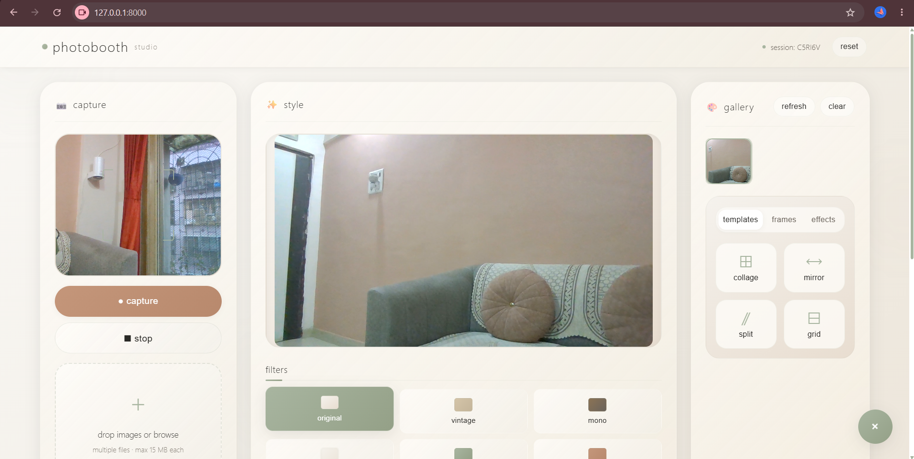
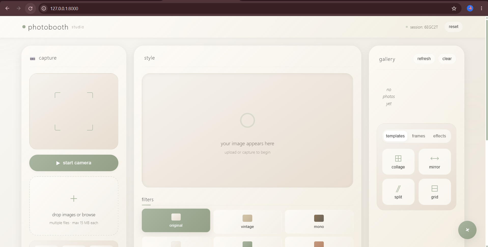

# Photobooth Studio

A web-based photobooth application that combines real-time photo capture, image editing, and AI-powered image similarity search. Users can capture photos using their webcam or upload existing images, apply filters, generate photobooth strips, and discover visually similar images through vector-based search.

## Features

* Live webcam capture with real-time preview
* Upload and edit multiple images
* Built-in filters including Vintage, Black & White, Blur, Enhance, and Retro
* Generate classic photobooth strips
* AI-powered image similarity search using vector embeddings
* Persistent image indexing and session management
* Responsive and interactive user interface
* Automatic image processing and metadata storage

## Tech Stack

### Frontend

* HTML5,    CSS3,   JavaScript,   Canvas API,   MediaDevices API.

### Backend

* FastAPI,  ChromaDB,  Pillow (PIL),   NumPy.

## Installation

Install the required dependencies and start the application:

```bash
python app.py
```

Open the application in your browser:

```text
http://localhost:8000
```

## Outputs

### Output 1



### Output 2



### Output 3



### Output 4


